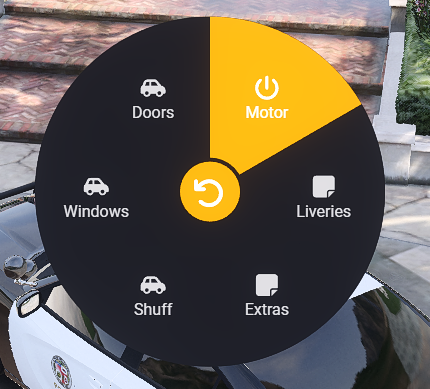
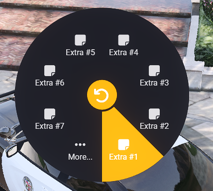
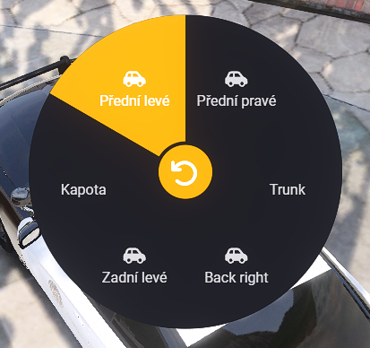
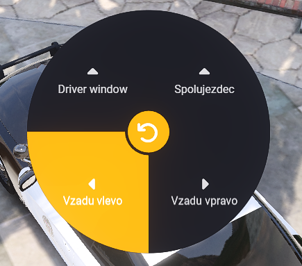
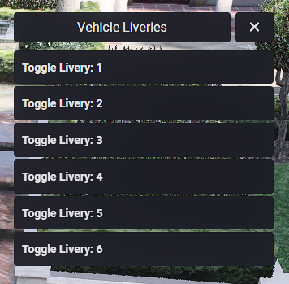
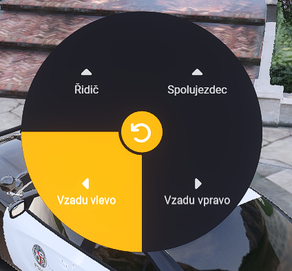

# gjn_vehicleradialmenu

- Simple Vehicle Menu with Radial Menu ([ox_lib](https://github.com/overextended/ox_lib))

- Menu

- Extras

- Doors

- Windows

- Livery

- Shuff

## RESMON

## REQUIREMENTS:
- [ox_lib](https://github.com/overextended/ox_lib)

# Credits
[Livery](https://github.com/juddisjudd/jdd_liveries/tree/main)